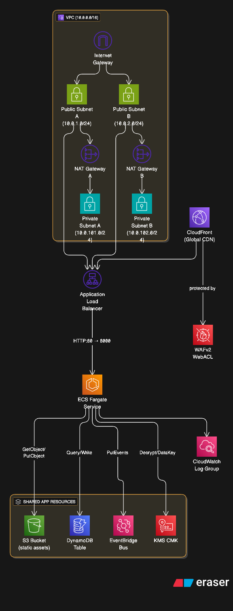

# High Scalable AWS Architecture

A production-ready, high-scalable AWS architecture deployed using CloudFormation, Terraform, and GitHub Actions. This project demonstrates a complete CI/CD pipeline that builds and deploys a FastAPI application on **AWS ECS Fargate** with supporting infrastructure, offering both serverless Lambda and containerized Fargate deployment options.

## 🏗️ Architecture Overview



This project deploys a comprehensive AWS architecture with the following components:

### Core Infrastructure

- **VPC**: Custom VPC with public/private subnets across 2 AZs
- **NAT Gateways**: High availability internet access for private subnets
- **Security Groups**: Properly configured security groups for ECS Fargate and ALB

### Application Layer

- **ECS Fargate**: Containerized FastAPI application with auto-scaling capabilities
- **Application Load Balancer (ALB)**: HTTP load balancer for high availability
- **CloudFront**: Global CDN for low-latency access (optional)
- **S3**: Static asset storage with versioning
- **DynamoDB**: NoSQL database with encryption and point-in-time recovery

### Container & Orchestration

- **ECS Cluster**: Managed container orchestration
- **Fargate Tasks**: Serverless container compute with 256 CPU / 512 MB memory
- **Target Groups**: Health check and traffic distribution
- **Auto Scaling**: Horizontal scaling based on demand

### Security & Monitoring

- **WAF**: Web Application Firewall for CloudFront (optional)
- **KMS**: Customer-managed encryption keys
- **EventBridge**: Event-driven architecture for decoupling
- **IAM**: Least privilege access policies
- **CloudWatch Logs**: Centralized logging for containers

### DevOps & CI/CD

- **ECR**: Container registry for Docker images
- **GitHub Actions**: Automated CI/CD pipeline with multi-stage deployment
- **Terraform**: Infrastructure as Code for ECR setup and IAM roles

## 📋 Prerequisites

1. **AWS Account** with appropriate permissions
2. **AWS CLI** configured with credentials
3. **Docker** installed locally
4. **Terraform** >= 1.0 installed
5. **GitHub repository** for CI/CD

## 🚀 Quick Start

### Option 1: GitHub Actions (Recommended)

1. **Fork this repository** to your GitHub account

2. **Set up AWS credentials for GitHub Actions:**

   First, you need to set up OIDC for secure authentication. Run this locally:

   ```bash
   # Update the github_repo variable in terraform/main.tf
   cd terraform
   terraform init
   terraform apply -var="github_repo=YOUR_USERNAME/YOUR_REPO_NAME"
   ```

3. **Add the GitHub Secret:**

   Get the role ARN from Terraform output:

   ```bash
   terraform output github_actions_role_arn
   ```

   Add this as `AWS_ROLE_ARN` in your GitHub repository secrets.

4. **Push to main branch** - This will trigger the deployment automatically!

### Option 2: Local Deployment

1. **Configure AWS CLI:**

   ```bash
   aws configure
   ```

2. **Run the deployment script:**
   ```bash
   ./scripts/deploy.sh YOUR_USERNAME/YOUR_REPO_NAME
   ```

## 📦 What Gets Deployed

### GitHub Actions Pipeline

The CI/CD pipeline consists of 6 main jobs:

1. **terraform-setup**: Creates ECR repository and IAM roles
2. **build-and-push**: Builds Docker image and pushes to ECR (only if changed)
3. **deploy-network**: Deploys VPC and networking components
4. **deploy-application**: Deploys shared infrastructure (DynamoDB, S3, EventBridge, KMS)
5. **deploy-ecs-fargate**: Deploys ECS Fargate service with Application Load Balancer
6. **cleanup-on-failure**: Automatic cleanup of failed deployments

### CloudFormation Stacks

- `high-scalable-network` (ap-southeast-4) - VPC and networking
- `high-scalable-application` (ap-southeast-4) - Shared infrastructure
- `fastapi-ecs-fargate` (ap-southeast-4) - ECS Fargate service and ALB

## 🐳 Container Architecture

### Fargate Deployment

- **Container Platform**: AWS ECS Fargate (serverless containers)
- **CPU/Memory**: 256 CPU units / 512 MB memory (configurable)
- **Auto Scaling**: Automatic horizontal scaling based on CPU/memory utilization
- **Health Checks**: ALB health checks on `/health` endpoint
- **Networking**: Private subnets with ALB in public subnets
- **Load Balancing**: Application Load Balancer with target groups

### Container Configuration

```dockerfile
# Dockerfile.apprunner optimized for ECS Fargate
FROM python:3.11-slim
WORKDIR /app
COPY app/requirements.txt .
RUN pip install --no-cache-dir -r requirements.txt
COPY app/ .
EXPOSE 8000
CMD ["python", "main_apprunner.py"]
```

## 🧪 Testing the API

Once deployed, you can test the FastAPI application:

```bash
# Get the ALB URL from CloudFormation outputs
ALB_URL=$(aws cloudformation describe-stacks \
  --stack-name fastapi-ecs-fargate \
  --region ap-southeast-4 \
  --query 'Stacks[0].Outputs[?OutputKey==`LoadBalancerUrl`].OutputValue' \
  --output text)

# Health check
curl $ALB_URL/health

# Get API info
curl $ALB_URL/

# Access Swagger UI
echo "Swagger UI: $ALB_URL/docs"

# Create an order
curl -X POST $ALB_URL/orders \
  -H 'Content-Type: application/json' \
  -d '{"customer": "John Doe", "product": "Widget", "quantity": 5}'

# Get the order
ORDER_ID="<order_id_from_previous_response>"
curl $ALB_URL/orders/$ORDER_ID

# Update order status
curl -X PUT $ALB_URL/orders/$ORDER_ID/status \
  -H 'Content-Type: application/json' \
  -d '{"status": "shipped"}'

# List all orders
curl $ALB_URL/orders
```

## 🎯 Key Features

### ✅ Smart Deployment

- Only deploys if Docker image has changed
- Skips redundant builds to save time and costs
- Proper dependency management between stacks
- Blue/green deployments with ECS rolling updates

### ✅ Production Ready

- Multi-AZ deployment for high availability
- Auto-scaling based on CPU and memory metrics
- Application Load Balancer with health checks
- Encrypted storage (S3, DynamoDB) with customer-managed keys
- Private networking with NAT gateways

### ✅ Cost Optimized

- Fargate pay-per-use pricing model
- Automatic scaling down to minimum capacity
- ECR lifecycle policies to manage image storage
- Automatic cleanup scripts to avoid ongoing charges
- Optimized container resource allocation

### ✅ Secure by Default

- VPC isolation with private subnets for Fargate tasks
- IAM roles with least privilege access
- All data encrypted at rest and in transit
- Security groups allowing only necessary traffic
- No internet access for container tasks (via NAT gateway)

### ✅ Highly Available

- Multi-AZ deployment across availability zones
- Application Load Balancer with health checks
- Auto-scaling and auto-healing capabilities
- Zero-downtime deployments with rolling updates

### ✅ Observable

- CloudWatch metrics enabled for all services
- Container logs centralized in CloudWatch
- ALB access logs and health check monitoring
- EventBridge for event-driven architecture
- Comprehensive health check endpoints

## 🛠️ Development

### Local Development

You can run the FastAPI application locally:

```bash
cd app
pip install -r requirements.txt

# For Fargate version
python main_apprunner.py

# For Lambda version
uvicorn main:app --reload
```

Visit http://localhost:8000 for the API and http://localhost:8000/docs for Swagger documentation.

### Project Structure

```
.
├── .github/workflows/
│   └── deploy.yml           # GitHub Actions CI/CD pipeline
├── app/
│   ├── main.py             # FastAPI application (Lambda)
│   ├── main_apprunner.py   # FastAPI application (Fargate)
│   └── requirements.txt    # Python dependencies
├── cform/
│   ├── ecs-fargate.yaml    # ECS Fargate CloudFormation template
│   ├── network.yaml        # VPC and networking template
│   ├── application.yaml    # Shared infrastructure template
│   └── waf-global.yaml     # WAF CloudFormation template (optional)
├── terraform/
│   ├── main.tf            # ECR and IAM resources
│   ├── variables.tf       # Terraform variables
│   └── outputs.tf         # Terraform outputs
├── scripts/
│   ├── deploy.sh          # Local deployment script
│   └── cleanup.sh         # Resource cleanup script
├── Dockerfile.apprunner   # Container definition for Fargate
├── Dockerfile             # Container definition for Lambda
└── README.md
```

## 🔄 Scaling & Performance

### Auto Scaling Configuration

The ECS Fargate service is configured with:

- **Desired Count**: 2 tasks (configurable)
- **Auto Scaling**: Based on CPU and memory utilization
- **Health Checks**: ALB health checks every 30 seconds
- **Deployment**: Rolling updates with zero downtime

### Performance Considerations

- **Container Resources**: 256 CPU / 512 MB memory (adjustable)
- **Load Balancer**: Application Load Balancer for HTTP/HTTPS traffic
- **Database**: DynamoDB with on-demand billing
- **Storage**: S3 with versioning and lifecycle policies

## 🧹 Cleanup

To avoid ongoing AWS charges, clean up all resources:

```bash
./scripts/cleanup.sh
```

This will delete:

- All CloudFormation stacks (including ECS Fargate)
- ECR repository and images
- Terraform state

## 🔧 Customization

### Environment Variables

The Fargate container uses these environment variables (automatically set by CloudFormation):

- `TABLE_NAME`: DynamoDB table name
- `EVENT_BUS_NAME`: EventBridge custom bus name
- `S3_BUCKET`: S3 bucket name for file uploads

### Scaling Configuration

You can modify the CloudFormation templates to adjust:

- **Fargate CPU/Memory**: Update TaskDefinition in `ecs-fargate.yaml`
- **Auto Scaling**: Modify DesiredCount and scaling policies
- **Load Balancer**: Adjust health check settings and timeouts
- **VPC Configuration**: Update CIDR blocks and subnet configuration

### Adding New Endpoints

1. Add new routes to `app/main_apprunner.py` (for Fargate) or `app/main.py` (for Lambda)
2. Update any required IAM permissions in `cform/ecs-fargate.yaml`
3. Push changes - GitHub Actions will automatically build and deploy

## 📚 Architecture Decisions

### Why ECS Fargate?

- **Serverless Containers**: No EC2 instances to manage
- **Auto Scaling**: Automatic horizontal scaling based on demand
- **Cost Effective**: Pay only for what you use
- **Integration**: Native integration with ALB, CloudWatch, and other AWS services
- **Flexibility**: Easy to migrate to other container platforms

### Why These Technologies?

- **FastAPI**: Modern, fast Python framework with automatic API documentation
- **ECS Fargate**: Serverless container platform with automatic scaling
- **DynamoDB**: Managed NoSQL database with single-digit millisecond latency
- **Application Load Balancer**: Layer 7 load balancing with health checks
- **EventBridge**: Decoupled, event-driven architecture for scalability
- **Terraform + CloudFormation**: Best of both worlds - Terraform for ECR/IAM, CloudFormation for AWS-native resources

### Regional Deployment

- **ap-southeast-4**: All resources including ECS Fargate, ALB, and supporting infrastructure
- **us-east-1**: WAF (optional, required for CloudFront if used)

## 🐛 Troubleshooting

### Common Issues

1. **ECS tasks not starting**: Check CloudWatch logs for the service
2. **ALB health check failures**: Verify container is exposing port 8000 and `/health` endpoint
3. **GitHub Actions failing**: Ensure AWS_ROLE_ARN secret is set correctly
4. **Container startup issues**: Check ECR image and Dockerfile configuration

### Debugging

```bash
# Check CloudFormation stack status
aws cloudformation describe-stacks --stack-name fastapi-ecs-fargate

# View ECS service logs
aws logs describe-log-groups --log-group-name-prefix /ecs/fastapi-ecs-fargate

# Check ECS service status
aws ecs describe-services --cluster fastapi-ecs-fargate-cluster --services fastapi-ecs-service

# Test ALB directly
ALB_URL=$(aws cloudformation describe-stacks --stack-name fastapi-ecs-fargate --query 'Stacks[0].Outputs[?OutputKey==`LoadBalancerUrl`].OutputValue' --output text)
curl $ALB_URL/health
```

## 📄 License

This project is licensed under the MIT License - see the [LICENSE](LICENSE) file for details.

## 🤝 Contributing

1. Fork the repository
2. Create a feature branch
3. Make your changes
4. Test locally using `./scripts/deploy.sh`
5. Submit a pull request

## 📞 Support

If you encounter issues:

1. Check the troubleshooting section above
2. Review CloudWatch logs for ECS tasks and ALB
3. Verify all CloudFormation stacks are deployed successfully
4. Open an issue with detailed error messages and steps to reproduce
